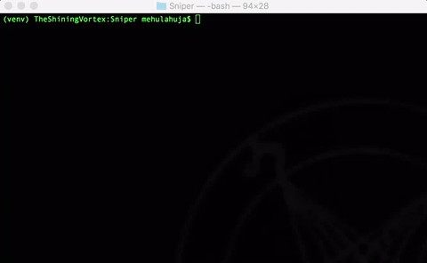
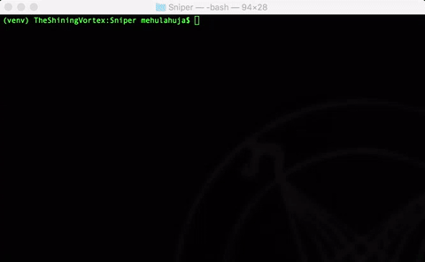
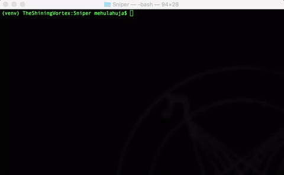

 
		

# What it is?
Sniper is a clould enabled, terminal based easy to use snippet manager.

# Getting Started
### Installation 
*Currently, sniper is shipped only via `pip`.*

**OS X**

`pip install sniper`

**Linux**

On linux you need to install `xsel` for sniper to work properly

`sudo apt-get install xsel`

Then just install via `pip`

`pip install sniper`

If there is a permission error use 

`pip install --user sniper`

**Windows**

`pip install sniper`

### Usage

- To kick things off you can create a new snippet using `sniper new` 

	***Note:*** *To store the snippet as an executable use `-e` flag.*

	

- Other commands - `ls`, `cat`, `rm`

	

- To get the snippet on clipboard, use `get` duh. If the name has spaces, put it in double 		quotes.

	`sniper get [snippet-name]`

- To find a snippet, use the `find` command 
	
	`sniper find [query-string]`

- You can edit the snippet using `edit`

	`sniper edit [snippet-name]`

- Use the `run` command if snippet is stored as an executable (stored with `-e` flag)

	`sniper run [snippet-name]`

**Cloud commands**

Basically Sniper uses two basic commands to store and retrieve snippets - `push` and `pull`

- If `push` is used directly, all the snippets stored locally will be pushed to server as  		private which means nobody except you will be able to access them. 

	`sniper push`

	If you wish to store a single snippet use the `-s` flag to specify the name of snippet. 

	`sniper push -s [snippet-name]`

	**Use `sniper push --help` for more info.**

- Pull also by default fetches all the snippets stored on server. 

	`sniper pull`

	Again if you wish to retrive a specific snippet, you can use the `-s` flag.

	`sniper pull -s [snippet-name]`

	**Use `sniper pull --help` for more info.**

	

***Note*** -  *You need to signup/signin to store the snippets on server*

**Use `sniper --help` for more information and commands. For help regarding specific commands use 
\
`sniper [command] --help`**

# Built With

Sniper uses the following open source projects  
* [Click](https://github.com/pallets/click) - For building the terminal interface
* [fuzzywuzzy](https://github.com/seatgeek/fuzzywuzzy) - For fuzzy search 
* [clipboard](https://pypi.python.org/pypi/clipboard/) - For copying text to clipboard 

# Contributing

Sniper would love contributions! To set up the development environment follow the below steps - 

**Prerequisites**
- Python3.x
- `sudo apt-get install xsel` (For linux)
- Golang 1.7 and above (for running the server locally)

**Steps**
1. Fork and clone the project.
2. Open you terminal and download `virtualenv` using `pip` if you don't have it already. 

	`pip install virtualenv`

3. `cd` into cloned project and create a virtual environment

	`virtualenv -p python3 venv`

4. Activate the environment.

	On OSX/Linux it's as simple as 

	`source venv/bin/activate`

	For Windows 

	`venv\Scripts\activate.bat`

5. Install sniper in the virtual environment 

	`pip install --editable .` 

	Don't forget the `.`! 

**For running the server locally**
1. Open `sniper/constants.py`, comment the production section and uncomment the testing 		section.

2. cd into `server` directory.

3. Run `go run main.go` and voila! You are running the Sniper Server.  

After making the changes locally, push them in your forked repository and make a pull request :) 

**Tests**

Just run `./script/test`

# Todo

 - More testing and tests (including server tests)
 - Make find realtime
 - Change editor functionality
 - Create a web interface to view public snippets
 - Improve docs 
 - Support regex in find query
 - Windows `python-Levenshtein` dependency fix
 - Ship through multiple package managers
 - Autocomplete
 
# License

This project is licensed under the MIT License - see the [LICENSE](LICENSE) file for details.